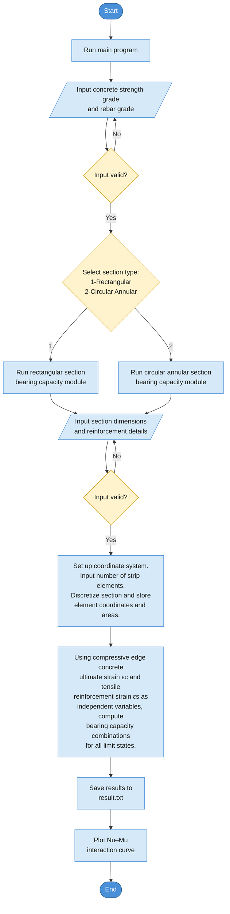
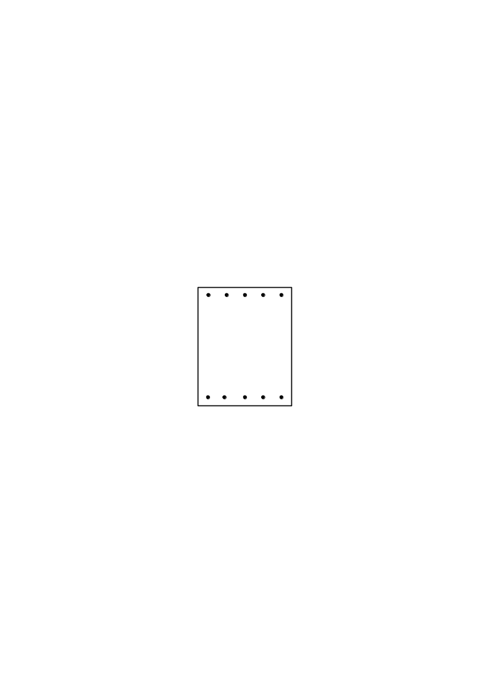
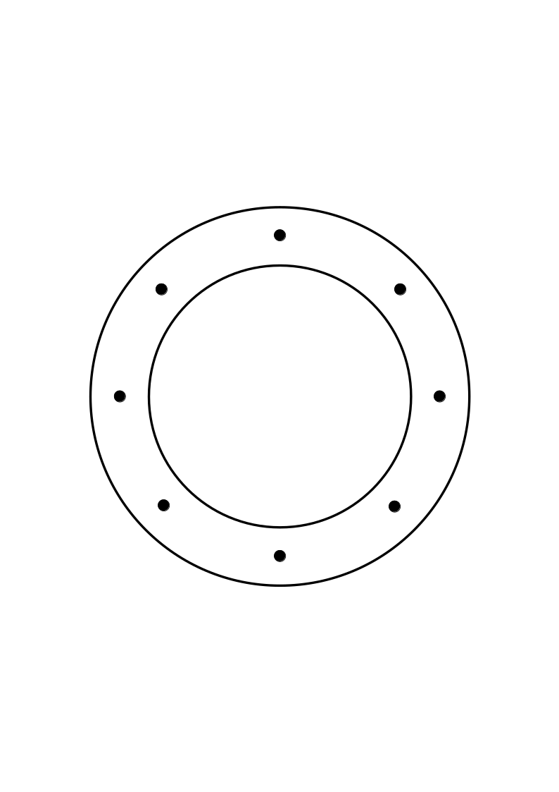
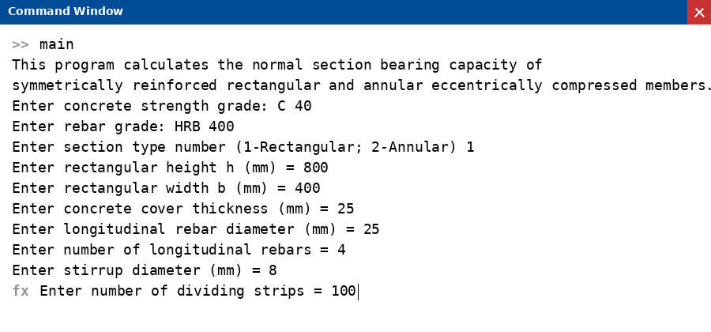
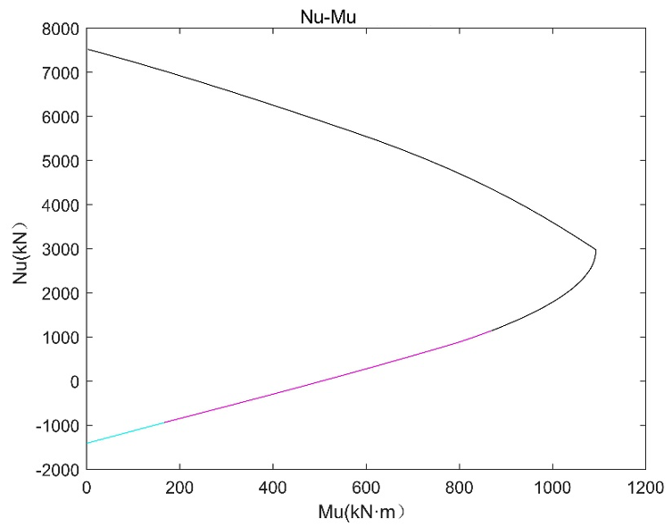
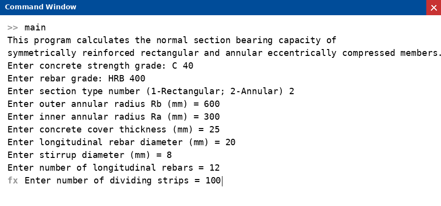
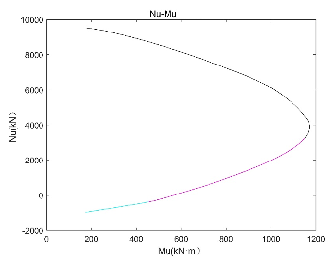

# Normal Section Bearing Capacity Calculator for Eccentrically Compressed RC Members

> Program design for calculating the normal section bearing capacity of rectangular and circular annular cross-sections under eccentric compression.

**Course**: Advanced Reinforced Concrete Structures  
**University**: Dalian University of Technology  
**Author**: Shanshou Li

---

## Abstract

This project implements a MATLAB-based calculation program for the normal section bearing capacity of eccentrically compressed members with rectangular and circular annular cross-sections, following the design methodology specified in the *Code for Design of Concrete Structures* (GB 50010-2010). The program's applicability is verified through worked examples, and the influence of different strip element discretization levels on the results is compared against the code formula calculations.

**Keywords**: MATLAB, normal section bearing capacity, strip element method

---

## 1. Program Flowchart

<em>Figure 1 — Program calculation flowchart</em>

---

## 2. Technical Description

### 2.1 Fundamental Assumptions

According to the *Code for Design of Concrete Structures* (GB 50010-2010), the normal section bearing capacity of concrete members (including flexural members) shall be computed based on the following five fundamental assumptions:

1. **Plane sections remain plane** — the strain distribution across the section is linear.
2. **Concrete tensile strength is neglected**.
3. **Concrete compressive stress–strain relationship** follows the prescribed curve:
   - Ascending branch (ε_c ≤ ε_0): σ_c = f_c · [1 − (1 − ε_c / ε_0)^n]
   - Plateau branch (ε_0 < ε_c ≤ ε_cu): σ_c = f_c
   - Where the parameters n, ε_0, and ε_cu are determined from the characteristic cube compressive strength f_cu,k:
     - n = 2 − (f_cu,k − 50) / 60 ≤ 2.0
     - ε_0 = 0.002 + 0.5 × (f_cu,k − 50) × 10⁻⁵ ≥ 0.002
     - ε_cu = 0.0033 − (f_cu,k − 50) × 10⁻⁵ ≤ 0.0033
4. **Ultimate tensile strain of longitudinal reinforcement** is taken as 0.01.
5. **Reinforcement stress** equals the product of strain and elastic modulus, bounded by: −f'_y ≤ σ_si ≤ f_y.

### 2.2 Implementation Method

The program discretizes both the concrete and reinforcement along the section height into strip elements (the number of strips is user-specified). Using the compressive edge concrete strain and the tensile reinforcement strain as independent variables, the curvature for each strain state is determined. The strain in each strip element is then computed from the curvature and the element's coordinate, and substituted into the material constitutive relationships to obtain the corresponding stresses. Finally, the internal forces are summed across all elements, and the equilibrium equations yield the axial force N_u and bending moment M_u.

### 2.3 Program Files

| File | Description |
|------|-------------|
| `main.m` | Main program file |
| `ConstiRelationConcrete.m` | Concrete constitutive relationship (called by main) |
| `ConstiRelationSteel.m` | Steel reinforcement constitutive relationship (called by main) |
| `FEAmn.m` | Strip element summation to compute N_u and M_u |
| `result.txt` | Output file — full N_u, M_u results |
| `resultA.txt` | Output file — results for N_u ≤ N_b |
| `resultB.txt` | Output file — results for N_u ≥ N_b |

> **Note**: The source code is available directly in the repository files above. Refer to the individual `.m` files for implementation details.

### 2.4 Rectangular Cross-Section

For the rectangular cross-section (Figure 2), three calculation modes are defined based on different failure scenarios:

1. **Tension reinforcement reaches ultimate tensile strain first** (large eccentricity).
2. **Compressive edge concrete reaches ultimate compressive strain first**, including the case of full-section compression (small eccentricity).
3. **Full-section tension** — only the reinforcement contributes to the bearing capacity.

Each mode produces a pair of (N_u, M_u). Combining all three modes yields the complete N_u–M_u interaction curve.

  

<em>Figure 2 — Rectangular cross-section schematic</em>

### 2.5 Circular Annular Cross-Section

The failure modes for the circular annular cross-section (Figure 3) are analogous to those of the rectangular section. The key difference is that the hollow inner ring must be subtracted from the concrete area during computation. Additionally, the reinforcement calculations are somewhat more involved due to the circular distribution of bars.

  

<em>Figure 3 — Circular annular cross-section schematic</em>

---

## 3. Usage Instructions and Results

### Rectangular Section

1. Run `main.m` in MATLAB.
2. Enter the concrete strength grade and rebar grade when prompted.
3. Select section type `1` for rectangular.
4. Input the section dimensions and reinforcement details (number of bars is per side).
5. Specify the number of strip elements.

  

<em>Figure 4 — Rectangular section: command window</em>

  

<em>Figure 5 — Rectangular section: N_u–M_u interaction curve</em>

### Circular Annular Section

1. Run `main.m` in MATLAB.
2. Enter the concrete strength grade and rebar grade when prompted.
3. Select section type `2` for circular annular.
4. Input the outer and inner radii and reinforcement details (number of bars is for the full section).
5. Specify the number of strip elements.

  

<em>Figure 6 — Circular annular section: command window</em>

  

<em>Figure 7 — Circular annular section: N_u–M_u interaction curve</em>

---

## 4. Verification Example

### 4.1 Problem Statement

**Given**: A column with axial compression design value N = 3000 kN, cross-section b = 400 mm, h = 800 mm, a_s = a'_s = 45 mm. Concrete grade C40, HRB400 reinforcement, symmetric layout with 4Φ25 on each side (A_s = A'_s = 1964 mm²). Stirrup diameter = 8 mm. Effective column length l_c = l_0 = 6 m. End moments M_1 = −M_2.

**Find**: The design bending moment capacity in the h-direction.

### 4.2 Code Formula Calculation

Since M_1/M_2 = −1, the inflection point lies within the column, so the P-δ effect is not considered.

First, assume large eccentricity and compute x:

> x = (N − f'_y · A'_s + f_y · A_s) / (α₁ · f_c · b) = (3000×10³ − 360×1964 + 360×1964) / (1.0×19.1×400) = 393 mm > ξ_b · h₀ = 0.518×755 = 391 mm

This indicates **small eccentricity compression failure**. A stability check in the perpendicular direction (treated as axial compression) gives:

> φ = 0.90 (from l₀/b = 15)  
> N_capacity = 0.9φ[f_c·b·h + f'_y·(A'_s + A_s)] = 6096.12 kN > 3000 kN ✓

For the first type of small eccentricity:

> ξ = x/h₀ = 0.520 → x = 392.6 mm  
> ξ_cy = 2β₁ − ξ_b = 1.082 → x < ξ_cy·h₀ = 816.9 mm ✓

Computing eccentricity:

> e = [α₁·f_c·b·x·(h₀ − x/2) + f'_y·A'_s·(h₀ − a')] / N = 726 mm  
> e_i = e − h/2 + a = 371 mm  
> e_a = h/30 = 27 mm  
> e₀ = e_i − e_a = 344 mm

**Result**: M = N · e₀ = 3000 × 10³ × 0.344 = **1032 kN·m**

### 4.3 MATLAB Program Results

The section and material parameters were input into the MATLAB program with N = 3000 kN. By varying the number of strip elements, the effect of discretization on the results was studied, as shown below.

| Strip Count | 4 | 6 | 12 | 25 | 50 | 100 |
|-------------|---|---|----|----|----|----|
| M_u (kN·m) | 1068 | 1083 | 1088 | 1090 | 1090 | 1090 |
| Relative Error | 3.36% | 4.69% | 5.19% | 5.29% | 5.30% | 5.31% |

### 4.4 Discussion

As the number of strip elements increases, the relative error (compared to the code formula) gradually increases and converges to approximately **5.30%**. This indicates that:

- **With fewer strips**, the numerical result is closer to the code formula, but less accurate in capturing the true section behavior.
- **With more strips**, the result converges to a more precise value that is slightly higher than the code prediction, suggesting the **code formula is conservative** and carries a built-in safety margin.
- Beyond a certain strip count (~50), further refinement has negligible effect on accuracy but significantly increases computation time.
- This observation is based on a single combination of cross-section geometry and reinforcement layout. Whether this trend generalizes to all configurations warrants further investigation.

---

## References

1. Li Aiqun. *Design Principles of Concrete Structures* [M]. China Architecture & Building Press, 2016.
2. Hu Xiaodong. *MATLAB: From Beginner to Expert* [M]. Posts & Telecom Press, 2015.
3. GB 50010-2010. *Code for Design of Concrete Structures* [S]. Beijing: China Architecture & Building Press, 2010.
4. Lu Yishi. "Comparative Study on Bearing Capacity Calculation Methods for Eccentrically Compressed Members" [J]. *Engineering Construction*, 2018, 50(11): 26–31.
5. Huang Liang, Lu Yiqiu, Xu Zipeng. "Revised Suggestions for Bearing Capacity Formulas of RC Eccentrically Compressed Members" [J]. *Engineering Mechanics*, 2012, 29(06): 169–175.
